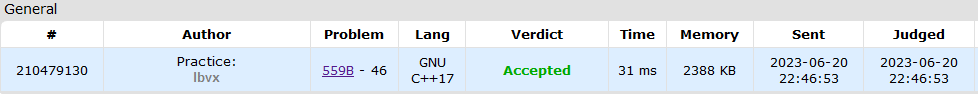
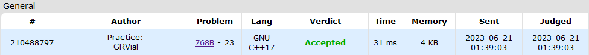
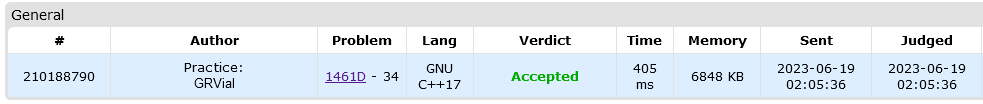
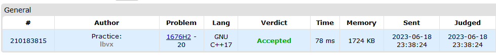

# Exercícios Codeforces

**Conteúdo da Disciplina**: D&C 

## Alunos
| Matrícula | Aluno |
| -- | -- |
| 19/0014032  | Guilherme Rogelin Vial |
| 19/0033088  | Lucas Braun Vieira Xavier |

## [Link pro Vídeo](https://drive.google.com/file/d/1eit-XIFLAHtOHFlLR0pxY_TDMRAx82oX/view?usp=sharing)

## Sobre

Exercícios do Codeforces resolvidos que utilizam algoritmos Dividir e Conquistar.

[559B - Equivalent Strings](https://codeforces.com/problemset/problem/559/B)

*[Link para submissão](https://codeforces.com/problemset/submission/559/210479130)*

[768B - Code For 1](https://codeforces.com/problemset/problem/768/B)

*[Link para submissão](https://codeforces.com/problemset/submission/768/210488797)*

[1461D - Divide and Summarize](https://codeforces.com/problemset/problem/1461/D)

*[Link para submissão](https://codeforces.com/problemset/submission/1461/210188790)*

[1676H2 - Maximum Crossings (Hard Version)](https://codeforces.com/problemset/problem/1676/H2)

*[Link para submissão](https://codeforces.com/contest/1676/submission/210183815)*

## Instalação e execução

Basta compilar os códigos em C++ e rodar.
